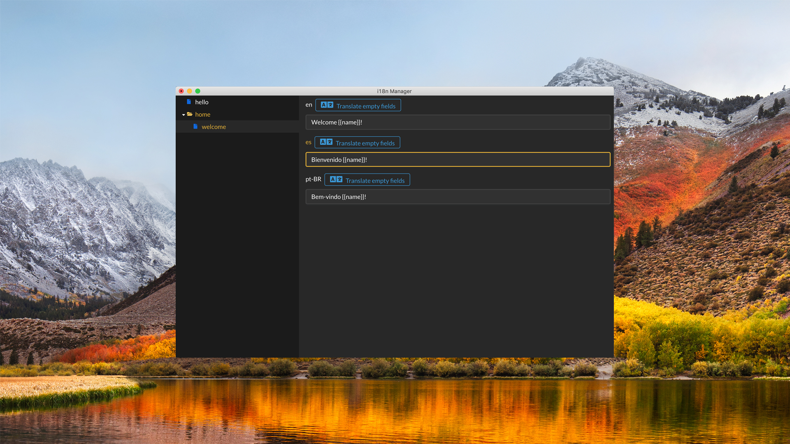
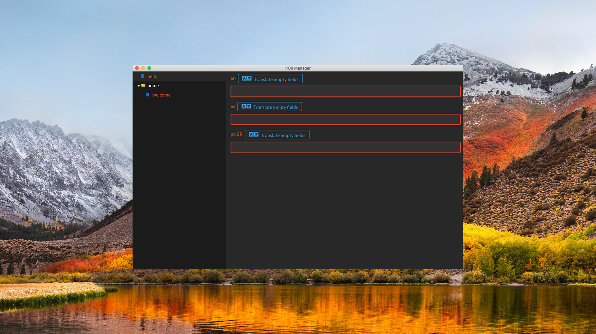

# i18n Manager

[](https://travis-ci.com/gilmarsquinelato/i18n-manager)
[](https://greenkeeper.io/)
[](https://www.codacy.com/project/gilmarsquinelato/i18n-manager/dashboard?utm_source=github.com&amp;utm_medium=referral&amp;utm_content=gilmarsquinelato/i18n-manager&amp;utm_campaign=Badge_Grade_Dashboard)
[](https://www.codacy.com/app/gilmarsquinelato/i18n-manager?utm_source=github.com&utm_medium=referral&utm_content=gilmarsquinelato/i18n-manager&utm_campaign=Badge_Coverage)

This app was developed with the objective to help the developers to manage the app translations.

Any type of contributions are welcome.

## Features

* Detect changed translations
* Detect missing translations
* Detect added translations
* Google Translate™ API Integration

## Current plugins and their supported extensions
### Feature requests and or pull requests with new plugins are welcomed 🙂
* json - [.json]


## Screenshots




## Developing

```yarn start```

## Building

```yarn build```
