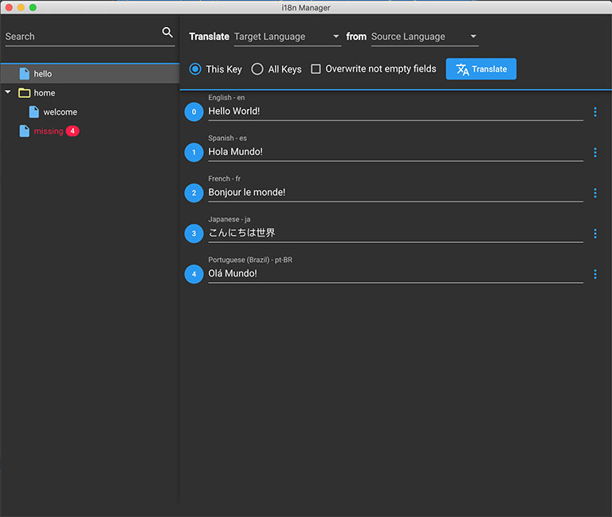
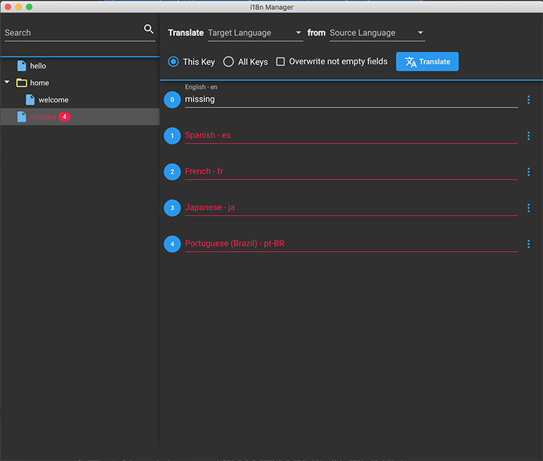
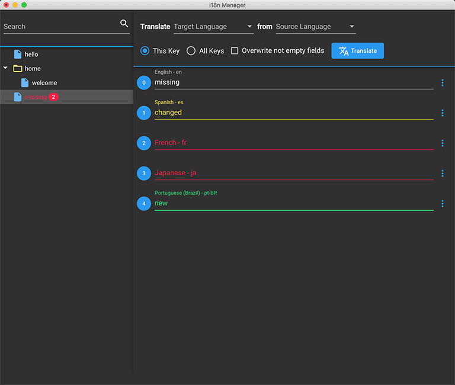

<p align="left"></p>

[](https://travis-ci.com/gilmarsquinelato/i18n-manager)
[](https://greenkeeper.io/)
[](https://www.codacy.com/project/gilmarsquinelato/i18n-manager/dashboard?utm_source=github.com&amp;utm_medium=referral&amp;utm_content=gilmarsquinelato/i18n-manager&amp;utm_campaign=Badge_Grade_Dashboard)
[](https://www.codacy.com/app/gilmarsquinelato/i18n-manager?utm_source=github.com&utm_medium=referral&utm_content=gilmarsquinelato/i18n-manager&utm_campaign=Badge_Coverage)

This app was developed with the objective to help the developers to manage the app translations.

Any type of contributions are welcome.

## Features

* Detect changed, missing and added translations
* Add, remove and rename translation keys (context menu)
* Add and remove folders (translation key inside another key, context menu)
* Google Translate™ API Integration
* It's free! 🙂

## Current plugins and their supported extensions

* json - [.json, .arb (Flutter Internationalization)]
* yaml - [.yaml, .yml]

**Feature requests and or pull requests with new plugins are welcomed 🙂**

**If you want to test the features, you can open the testData folder!**

## Projects using i18n Manager

* [Phoenix - Burst Coin Wallet UI](https://github.com/burst-apps-team/phoenix)

## Screenshots







## Developing

**This project is developed with Angular, so it will need the Angular CLI (```yarn global add @angular/cli```)**

```yarn start```

## Building

```yarn build```

## Contributors

logo designed by [@reallinfo](https://github.com/reallinfo)
