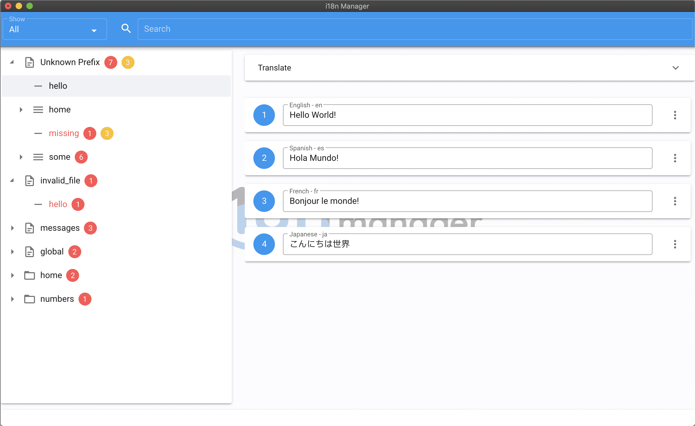

<p align="left"></p>


[](https://www.codacy.com/project/gilmarsquinelato/i18n-manager/dashboard?utm_source=github.com&amp;utm_medium=referral&amp;utm_content=gilmarsquinelato/i18n-manager&amp;utm_campaign=Badge_Grade_Dashboard)
[](https://snyk.io/test/github/gilmarsquinelato/i18n-manager?targetFile=package.json)


------
# WARNING!

This project has entered on looking for new owner stage.

Developing this tool has being great, but recently I ([@gilmarsquinelato](https://github.com/gilmarsquinelato)) am not contributing too much with it, and I don't think it's fair to the people that are 
using this tool, so I am stopping to contribute with this tool and happy to transfer the project to the people that really wants to keep maintaining it.

Thank you!

------ 

This app was developed with the objective to help the developers to manage the app translations.

Any type of contributions are welcome.

## Features

* Detect changed, missing, duplicated/untranslated keys and added translations
* Add, remove and rename translation keys (context menu)
* Nested keys support
* Google Translate™ API Integration
* File changes detection
* It's free! 🙂

## Current plugins and their supported extensions

* json - [.json, .arb (Flutter Internationalization)]
* yaml - [.yaml, .yml]

**Feature requests and/or pull requests with new plugins are welcomed 🙂**

**If you want to test the features, you can open the testData folder!**

## Projects using i18n Manager

* [Phoenix - Burst Coin Wallet UI](https://github.com/burst-apps-team/phoenix)

## Screenshots




## Developing

```yarn start```

## Building

```yarn build```

## Contributors

logo designed by [@reallinfo](https://github.com/reallinfo)
